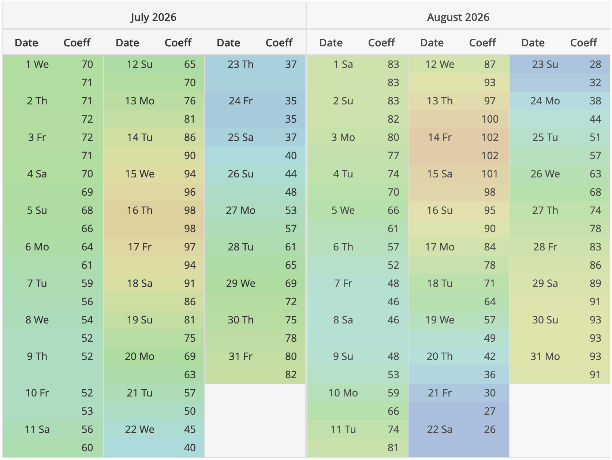

----

<!-- ## Pâques 2025 -->

<!-- - **Lieu** : Cavalaire, au [150, allée Trémière.](https://maps.app.goo.gl/ARBdEF7RomfWtA4y6) [Description de la location sur Abritel.](https://www.abritel.fr/location-vacances/p1559446?chkin=2025-04-19&chkout=2025-04-26&d1=2025-04-19&d2=2025-04-26&startDate=2025-04-19&endDate=2025-04-26&x_pwa=1&rfrr=HSR&pwa_ts=1731235639382&referrerUrl=aHR0cHM6Ly93d3cuYWJyaXRlbC5mci9Ib3RlbC1TZWFyY2g%3D&useRewards=false&adults=10&regionId=5820&destination=La%20Croix-Valmer%2C%20Var%2C%20France&destType=BOUNDING_BOX&latLong=43.20652%2C6.568811&total_price=0%2C2763&privacyTrackingState=CAN_TRACK&searchId=f731331e-77e3-472e-af7d-8e094b23e8cf&sort=RECOMMENDED&top_dp=2201&top_cur=EUR&userIntent=&selectedRoomType=33393363&selectedRatePlan=0003c5787f7ffc0e421680a75be28e560c9f&expediaPropertyId=33393363) Aucune location n'était disponible le long de la rivière à La Londe, et la maison de l'avenue de la Castillane à Cavalaire n'était pas disponible non plus... 😢 -->

<!-- - **Dates** : du samedi 19 au samedi 26 avril 2025. C'est la première semaine des vacances scolaires de la zone A (Poitiers, La Rochelle), deuxième semaine de celles de la zone C (Toulouse). -->

<!-- <iframe src="https://www.google.com/maps/embed?pb=!1m18!1m12!1m3!1d2909.567215352485!2d6.510897013174119!3d43.17660788300228!2m3!1f0!2f0!3f0!3m2!1i1024!2i768!4f13.1!3m3!1m2!1s0x12cece676e4b788d%3A0xe4d8df7233a5d611!2sAll.%20Tr%C3%A9mi%C3%A8re%2C%2083240%20Cavalaire-sur-Mer!5e0!3m2!1sfr!2sfr!4v1731572573722!5m2!1sfr!2sfr" width="600" height="450" style="border:0;" allowfullscreen="" loading="lazy" referrerpolicy="no-referrer-when-downgrade"></iframe> -->

<!-- ## Toussaint 2025

- **Dates** : du samedi 18 au samedi 25 octobre. Il s'agit de la première semaine des vacances scolaires. 
- **Lieu** : La Londe. Grom a versé les arrhes. Il faudra payer 640€ avant le 18 septembre

Location située au 279 quai Jean Lamoudru à La Londe les Maures. On ouvre le portail, on traverse la route, et on est au bateau ! De la place dans le jardin pour stocker la remorque compresseur, qui est restée sans ridelles ni bâche tous les jours de beau temps. Ducato garé le long du quai, on ne démarre que pour aller gonfler. Un grand préau pour stocker les sacs de plongée, les blocs, et s'équiper à l'abri du vent, avec un petit débarras pour les recycleux, les bidons et les analyseurs. Maison également très agréable : 2 chambres avec lit double (avec possibilité de poser un matelas dans la plus grande), une chambre avec un lit double et 2 lits superposés. Deux salles de bain et 3 WC. Grande pièce de vie avec clic-clac, terrasses, c'est top quand il fait beau. Il y a de quoi venir à 10.

<iframe src="https://www.google.com/maps/embed?pb=!1m18!1m12!1m3!1d2912.3098151572226!2d6.245350816532982!3d43.11901746114732!2m3!1f0!2f0!3f0!3m2!1i1024!2i768!4f13.1!3m3!1m2!1s0x12c92f7817eca977%3A0xeae7976797a2090!2s279%20Quai%20Lamoudru%2C%2083250%20La%20Londe-les-Maures!5e0!3m2!1sen!2sfr!4v1756284215126!5m2!1sen!2sfr" width="600" height="450" style="border:0;" allowfullscreen="" loading="lazy" referrerpolicy="no-referrer-when-downgrade"></iframe>
 -->

## Pâques 2026

- **Dates** : du 11 au 18 avril (2e semaine des vacances scolaires de la zone A)
- **Lieu** : Marseille, en attente du feu vert de René ! Sinon, ailleurs !

## Été 2026
 
- **Dates** : du 18 au 25 juillet
- **Lieu** : Camaret

L'hébergement est en cours de réservation. J'ai bloqué provisoirement la même maison qu'il y a 2 ans, située au 29 Rue du Vallon, 29160 Crozon :

<iframe src="https://www.google.com/maps/embed?pb=!1m14!1m8!1m3!1d2657.149962587772!2d-4.4903547!3d48.2422406!3m2!1i1024!2i768!4f13.1!3m3!1m2!1s0x4816c1455f273fa3%3A0xf2100fc72470fde6!2s29%20Rue%20du%20Vallon%2C%2029160%20Crozon!5e0!3m2!1sfr!2sfr!4v1767893034033!5m2!1sfr!2sfr" width="600" height="450" style="border:0;" allowfullscreen="" loading="lazy" referrerpolicy="no-referrer-when-downgrade"></iframe>

Tarif moins élevé qu'en 2024 grâce à une ristourne de Booking.com : 1684€ qui seront débités de mon compte début juillet. Annulation gratuite possible jusqu'au 13 juillet.

Pour les détails du séjour précédent, [voir ici](https://besibo.github.io/AP/Camaret2024.html#pour-m%C3%A9moire), et pour le descriptif de la maison sur Booking.com, c'est [par là](https://sp.booking.com/hotel/fr/ker-seasea-vue-mer-wifi.fr.html?aid=882988&label=adtechclicktripz-link-dcomparetofr-city-M1416272_pub-3127_campaign-4601_xqdz-7b5d51b969d7f7c70c6f8013c2940ff2_los-01_bw-007_lang-fr_curr-EUR_nrm-01_gstadt-02_gstkid-00_clkid-28cdeb005ec4ad5036e94e2e2fb2f2da&sid=81576bb4ed2502ce40882105f4059b69&checkin=2024-07-13;checkout=2024-07-20;dest_id=-1423109;dest_type=city;dist=0;group_adults=10;group_children=0;hapos=1;hpos=1;no_rooms=1;req_adults=10;req_children=0;room1=A%2CA%2CA%2CA%2CA%2CA%2CA%2CA%2CA%2CA;sb_price_type=total;soh=1;sr_order=popularity;srepoch=1712522013;srpvid=60dc908b0f520501;type=total;ucfs=1&#no_availability_msg).

Par ailleurs, Thomas tente de contacter le propriétaire de la maison de Lanvéoc où nous étions allées en 2018. Le tarif était à l'époque bien plus avantageux (moins de 1000€), la maison plus pratique pour garer les véhicules, mais les couchages bien moins bons. À suivre...

**Horaires des marées à Brest**

{width=75%} 
{width=35%} 

