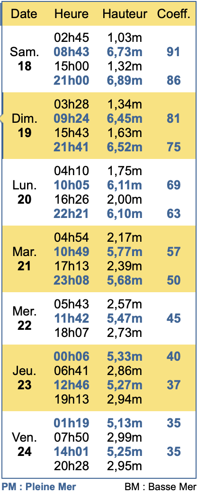

```{r}
#| include: false
library(tidyverse)
library(janitor)
library(kableExtra)
library(scales)

options(knitr.kable.NA = '')
```


```{r}
#| include: false
# fmt: skip

# Update this chunk every day

## Dive sites
sites <- c(
  "Kleber", "Swansea Vale", # Dimanche
  "Le Kenilworth", "Le Forest Castle", # Lundi
  NA, NA, # Mardi
  NA, NA, # Mercredi
  NA, NA, # Jeudi
  NA, NA) # Vendredi

## Who dived where?
plongees <- tibble(
  #			           Bap, Beu, Cal, Car, Ped, Tho, Yan
  `Plongée 01` = c(1, 1, 1, 1, 1, 1, 1),
  `Plongée 02` = c(1, 0, 1, 0, 1, 0, 1),
  `Plongée 03` = c(1, 1, 1, 1, 1, 1, 1),
  `Plongée 04` = c(1, 1, 1, 1, 1, 1, 1),
  `Plongée 05` = c(0, 0, 0, 0, 0, 0, 0),
  `Plongée 06` = c(0, 0, 0, 0, 0, 0, 0),
  `Plongée 07` = c(0, 0, 0, 0, 0, 0, 0),
  `Plongée 08` = c(0, 0, 0, 0, 0, 0, 0),
  `Plongée 09` = c(0, 0, 0, 0, 0, 0, 0),
  `Plongée 10` = c(0, 0, 0, 0, 0, 0, 0),
  `Plongée 11` = c(0, 0, 0, 0, 0, 0, 0),
  `Plongée 12` = c(0, 0, 0, 0, 0, 0, 0)
)

## Who spent what (only for dives and only for members!)
depenses <- tribble(
  ~Qui  , ~`Essence bateau` , ~`Essence compresseurs` , ~Port , ~Gaz , ~Divers ,
  "bap" ,                 0 ,                       0 , 163.2 ,    0 ,       0 ,
  "beu" ,                 0 ,                       0 ,   0   ,    0 ,       0 ,
  "cal" , 128 * 2           ,                       0 ,   0   ,    0 ,       0 ,
  "car" ,               128 ,                       0 ,   0   ,    0 ,       0 ,
  "ped" ,                 0 ,                       0 ,   0   ,  111 ,       0 ,
  "tho" ,                 0 ,                       0 ,   0   ,    0 ,       0
)

## Who spent what (one line per diver, members or not, for everything not dive-related)
autres <- tribble(
  ~Qui  , ~Logement , ~Nourriture          , ~Carburant , ~Peages , ~Navette , ~Autre ,
  "bap" , 200       ,   0                  , 131.98     ,       0 ,        0 ,      0 ,
  "beu" , 440.80    , 148.75               ,  14.80     ,       0 ,        0 ,      0 ,
  "cal" , 200       ,   0                  , 108        ,       0 ,        0 ,      0 ,
  "car" , 200       , 241.86               ,   0        ,       0 ,        0 ,      0 ,
  "ped" , 400       , 14.82 + 26.50 + 5.57 ,   0        ,       0 ,        0 ,      0 ,
  "tho" , 200       ,   0                  , 200.94     ,       0 ,        0 ,      0 ,
  "yan" ,   0       ,   0                  ,   0        ,       0 ,        0 ,      0
)
```


```{r}
#| include: false
# fmt: skip

# Update once for every diving trip

## List of members
membres <- c("Bap", "Beu", "Calude", "Carole", "Pedro", "Thomas")
membres.full <- c(
  "Baptiste",
  "Benoît",
  "Jean-Claude",
  "Carole",
  "Pierre",
  "Thomas"
)

## List of guests
invites <- c("Yannick")
invites.full <- c("Yannick")

## For each diver, how many people in charge (divers + non-divers included)
famille <- c(1, 1, 1, 1, 2, 1, 1)

## For each diver, how many nights and meals
nuitees <- famille * 7
repas <- nuitees * 3

## Total number of people including non divers
nb.pers <- sum(famille)

## Diving days
first.day <- "19-07-2026"
last.day <- "24-07-2026"

## Runtime for the Yamaha
start.hours <- 943.3
end.hours <- 960.0

## Volume of fuel used
vol.fuel <- 300
conso.fuel <- 237.2
dist <- 116.1 # Nautic miles

## Cost for guest
dive.guest <- 26

## Overhead of diving Cost
overhead <- 3 # €

source("computations.R")
```


----

## Plongeurs présents

Membres : `r membres.full`  
Invités : `r invites.full`

## Les plongées

```{r}
#| echo: false
#| label: tbl-plongee
#| tbl-cap: "Récapitulatif des plongées effectuées"

beautify_table(liste_plongees)
```

Au total, `r liste_plongees |> pull(Total) |> sum()` plongées ont été effectuées.

## Les dépenses "plongée"

Les dépenses entrant dans le calcul du coût des plongées sont détaillés dans le tableau ci-dessous.

```{r}
#| echo: false
#| tbl-cap: "Dépenses engagées par les membres de l'AP"
#| label: tbl-dep_plong

beautify_cost_table(depenses)
```

<!-- Ici, les dépenses de la rubrique "divers" concernent le remplacement des fusées de détresse et l'achat d'un pavillon alpha neuf. Le pavillon est neuf, mais il est minuscule et sera certainement inutilisable... -->


## Coût des plongées


Le coût d'une plongée est calculé en divisant la somme des dépenses effectuées durant le séjour (ici, `r depenses |> pull(Total) |> sum()`€) par le nombre total de plongées effectuées durant le séjour (ici, `r liste_plongees |> pull(Total) |> sum()` plongées). Pour cette sortie, le coût d'une plongée pour les membres de l'AP est de `r cout_membres - overhead`€. Toutefois, afin d'anticiper sur la révision annuelle du moteur, nous avons décidé de majorer chaque plongée de `r overhead`€. Ainsi, **pour les membres, la plongée coûte `r cout_membres`€**.

Pour les invités, le prix de la plongée est fixé à `r cout_guest - overhead`€ si la plongée des membres coûte moins cher. Sinon, tout le monde paie le même prix. La même majoration de `r overhead`€ est appliquée pour les invités, soit un prix de `r cout_guest`€ par plongée.

Au total, pour les plongées uniquement, chaque plongeur doit les sommes suivantes à  l'AP :

```{r}
#| echo: false
#| tbl-cap: "Montants dûs pour la plongée"
#| label: tbl-cout_plongee

cout_plongee |>
  select(Plongeur, Cout) |>
  pivot_wider(names_from = Plongeur, values_from = Cout) |>
  beautify_cost_table(total = FALSE)
```

## Les dépenses "hors plongée"

Pour cette sortie, les dépenses n'entrant pas dans le prix des plongées et la liste des payeurs sont présentés dans la @tbl-cout_hors_plongee. Pour chaque plongeur (et sa famille), les nombres de nuitées et de repas pris au cours du séjours sont indiqués dans la @tbl-nights_and_food :

```{r}
#| echo: false
#| tbl-cap: "Dépenses hors plongées engagées par les participants à  la sortie"
#| label: tbl-cout_hors_plongee

beautify_cost_table(autres)
```

Ici, les dépenses de la rubrique "autre" concernent la réparation de la crevaison du Ducato la veille du départ et les photocopies du macaron pour le stationnement.

```{r}
#| echo: false
#| tbl-cap: "Nombre de nuitées et de repas"
#| label: tbl-nights_and_food

beautify_table(nr, total = FALSE)
```

Pour chaque **personne** (plongeur ou non), le coût d'une nuitée, d'un repas et du transport s'élèvent à  :

```{r}
#| echo: false
#| tbl-cap: "Coûts unitaires par personne"
#| label: tbl-other_per_person

beautify_cost_table(autres_unit, total = FALSE)
```

## Bilan et remboursement

Au final, chaque **plongeur** doit donc les sommes suivantes

```{r}
#| echo: false
#| tbl-cap: "Bilan des coûts par plongeur et par poste"
#| label: tbl-cost_per_diver

beautify_cost_table(cout_all)
```

Compte tenu des sommes déjà  engagées, les remboursements à effectuer sont les suivants :

```{r}
#| echo: false

beautify_cost_table(rembourse, total = FALSE)
```


## Bénéfices, essence et heures

La majoration de `r overhead`€ de chaque plongée ainsi que les plongées des invités (si la plongée des membres coûte moins de `r dive.guest`€) permettent de faire des (petits) bénéfices. Ils s'élèvent ici à **`r benef`€**.


Le moteur a tourné `r end.hours-start.hours` heures et `r vol.fuel` litres de sans plomb ont été mis dans le réservoir. D'après la console, `r conso.fuel` litres ont été consommés soit une consommation moyenne de `r round(conso.fuel/(end.hours-start.hours),2)` litres à l'heure. Il devrait donc rester environ `r vol.fuel-conso.fuel` litres dans le réservoir. Thomas en a sorti 55 litres. L'erreur d'estimation de consommation est donc très faible : `r round((vol.fuel-conso.fuel - 55)/conso.fuel * 100, 1)`%.

Pour finir, nous avons parcouru `r dist` milles nautiques. Ça veut dire que nous consommons en moyenne `r round(conso.fuel/dist, 2)` litres par mille, soit `r round(conso.fuel/dist/1.852, 2)` litres au kilomètre, soit la bagatelle de `r 100 * round(conso.fuel/dist/1.852, 2)` litres au 100 kilomètres. La plongée est un sport écologique !

<!-- Nous avons commencé à nettoyer les boudins. Il reste la plus grosse part du boulot : le savon spécial est dans la console et le balais brosse dans le Ducato : avis aux amateurs ! -->


## Pour mémoire

Comme il y a deux ans, nous étions au [29 Rue du Vallon à Crozon](https://sp.booking.com/hotel/fr/ker-seasea-vue-mer-wifi.fr.html?aid=882988&label=adtechclicktripz-link-dcomparetofr-city-M1416272_pub-3127_campaign-4601_xqdz-7b5d51b969d7f7c70c6f8013c2940ff2_los-01_bw-007_lang-fr_curr-EUR_nrm-01_gstadt-02_gstkid-00_clkid-28cdeb005ec4ad5036e94e2e2fb2f2da&sid=81576bb4ed2502ce40882105f4059b69&checkin=2024-07-13;checkout=2024-07-20;dest_id=-1423109;dest_type=city;dist=0;group_adults=10;group_children=0;hapos=1;hpos=1;no_rooms=1;req_adults=10;req_children=0;room1=A%2CA%2CA%2CA%2CA%2CA%2CA%2CA%2CA%2CA;sb_price_type=total;soh=1;sr_order=popularity;srepoch=1712522013;srpvid=60dc908b0f520501;type=total;ucfs=1&#no_availability_msg). 

La maison est toujours aussi agréable, mais sur 4 niveaux en comptant le garage. Le garage est d'ailleurs très pratique pour le matos et le bricolage, et le jardin permet de stocker du matos et de faire sécher tout ce qui doit sécher quand il y a du soleil.

## Journal de bord

**Dimanche 19 juillet**. Nous avons attaqué la semaine par le Kléber, le classique de Camaret. C'est toujours aussi gros, mais ça s'affaisse gentiment. Et c'était très sombre, en raison d'un gros tapis d'algues brunes sur toute une partie de l'épave. Les homards et langoustes sont nombreux, mais personne n'était très enthousiaste en raison de l'ambiance générale que nous avons connu bien plus belle sur cette épave. Baptiste, qui était de sécu surface avec Calude a gagné le concours de bulles : après immersion, il a dû remonter sur le bateau pour régler un problème de fuite sur son détendeur oxy. Il a aussi des microbulles partout (détendeurs, manos, injecteurs...) : grosse commande de swivels en perspective. Les nettoyages au vinaigre blanc de l'hiver ont été très efficaces ! En remettant son recycleur sur le dos, il s'est à moitié arraché l'épaule gauche : petite pensée pour Nath en ce jour d'anniversaire ! Il a finalement pu se remettre à l'eau. Calude a poireauté 15 minutes en surface en claquant des dents. Il était bleu en sortant de l'eau une heure plus tard. On avait prévu la glacière et un deuxième bi pour Carole, ce qui nous a évité de rentrer au port à midi. Et c'est tant mieux car Calude et Baptiste sont sortis de l'eau à 12h30. Nous avons donc mangé au soleil, en remplissant tranquillement nos combis étanches de transpiration. Environ une heure avant l'étale, Carole, Thomas et moi avons basculé pour assurer le mouillage sur le Kenil Worth. Très vite à la descente, nous nous sommes rendus compte que le courant allait être très fort. Carole est rapidement remontée, mais le plomb, coincé à 40m, nous a obligés à descendre. La lutte fut âpre, mais nous y sommes parvenus à la force des bras au bout de plus de 10 minutes de descente. Arrivé au fond, l'ambiance de sable blanc et les langoustes faisaient envie, mais comme nous sommes très raisonnables, on a simplement renvoyé le plomb avant de remonter. Sur la bateau, on a enfin sorti la carte SHOM (bonne idée de faire ça après coup...) pour constater que dans le coin, il est difficile (impossible ?) de plonger à l'étale de basse mer en période de vives eaux (or, nous sommes encore en vives eaux jusqu'à demain). Pour nos 4 compères, nous nous sommes donc rabattus sur le Swansea, en prenant soin de prévenir "Brest approche" à la VHF (canal 16, puis bascule sur canal 8, 2 fois 4). Le Swansea relevant du secteur "Saint Matthieu", on a contacté Saint Matthieu sur le canal 10, unité zéro. Moralité : ne pas s'emmerder à contacter qui que ce soit quand on plonge sur le Swansea : tout le monde s'en fout. La plongée était belle, mais avec pas mal de jus au fond également. Même l'arrière de l'épave est écrasé, mais il y a de la vie. De retour au port, sur le parking en épis, un bon coup de vent a fermement ouvert la porte arrière droite du Ducato, qui est venue s'encastrer délicatement dans l'aile arrière gauche d'un gros SUV VW, garé un peu trop près. En avant pour le constat, car ça s'est presque fait sous les yeux des propriétaires. Retour à la location à 19h00 : gonflage, séchage, bricolage, douches... On attaque l'apéro à 21h45, en appelant Nath... Pour ma part, je suis cramoisi !

**Lundi 20 juillet 2026**. Réveil de bonne heure après une bonne nuit de sommeil, suffisamment fraiche pour être réparatrice, en dépit des ronflements de Thomas. Départ à la journée à nouveau. Superbe plongée sur le Kénilworth le matin, et sans aucun jus cette fois (étale de PM, coef 69). Très clair, très poissonneux, beaucoup de homards et encore plus de langoustes. Nouveau record de nombre de langoustes dans le même champ visuel : 18 d'un coup, entre l'hélice et le safran. Très belle ambiance de sable blanc, banc de tacauds, hélice et hélice de rechange, ancres, gros congres et petites crevettes... Tout le monde a beaucoup apprécié. À la sortie de l'eau, on a perdu Calude pendant quelques secondes : il était en surface, CCR déséquipé en attendant le bateau. On s'approchait de lui pour le sortir de l'eau, quand il a disparu quelques secondes ! Sa stab s'est vidée pour une raison inconnue, il était encore accroché au recycleur par la console (au poignet), qui l'a donc promptement entraîné vers le fond. Il a donc fait une petite apnée le temps de regonfler sa stab... Pas de noyade mais un bon début de crampe dans la jambe droite ! Pique-nique gastronomique (jambon, saucisson, pâté, corps gras, fromage et chocolat, mais aussi taboulé, tomates et carottes râpées) sur le bateau, un peu moins irrespirable que la veille, et parce qu'on s'améliore de jour en jour, on a même eu le temps pour la sieste digestive en plein soleil. Le vent s'est levé assez fort en début d'après-midi. La peur du courant de la veille nous a incité à temporiser avant la mise à l'eau sur le Forest Castle. En fait, pas du tout de jus. Par contre, visi vraiment pas terrible par rapport à la plongée de 2024, et peu de poissons, à part au niveau des blocs moteur/chaudière. Pedro a fini au parachute car un peu paumé sur l'épave, et son bloc de 1 litre était à sec, donc plus d'air dans la stab ni dans la combi étanche. Baptiste et détesté et juré ses grands Dieux qu'il n'y remettra pas les pieds. On verra bien !... De mon côté, j'ai promené un bel oursin pendant presque une heure, jusqu'au palier où j'ai croisé Baptiste et Calude qui descendaient. L'ADV de Calude lui fait des misères, donc il a eu du mal à descendre. Il a dû tirer fort sur le bout (qui, à sa décharge, était vraiment très horizontal), nous nous sommes amoureusement entrechoqués, et mon oursin ne s'en est pas remis. Le retour au port fut pour le moins musclé : clapot plus que naissant et vent dans le nez. Thomas a fait des merveilles au cerceau : ça n'a presque pas tapé, ça n'a presque pas rincé. Retour au port un peu plus tôt que la veille : gonflage pour les uns, courses pour les autres. Et enfin, apéro à 21h15.


## Quelques graphiques

```{r}
#| echo: false
#| label: fig-plong
#| fig-cap: "Plongeurs à bord du Valiant lors de chaque plongée"
#| fig-asp: 0.4

pl1
```

```{r}
#| echo: false
#| label: fig-dep
#| fig-cap: "Proportion des dépenses par poste, pour la plongée et le reste"

pl2
```

```{r}
#| echo: false
#| label: fig-all
#| fig-cap: "Proportion des dépenses de la sortie, tous postes confondus"
#| fig-asp: 0.618

pl3
```


{width=45%} 


<!-- <br>

::: {layout-ncol=4}

{group="dive"}

::: -->
